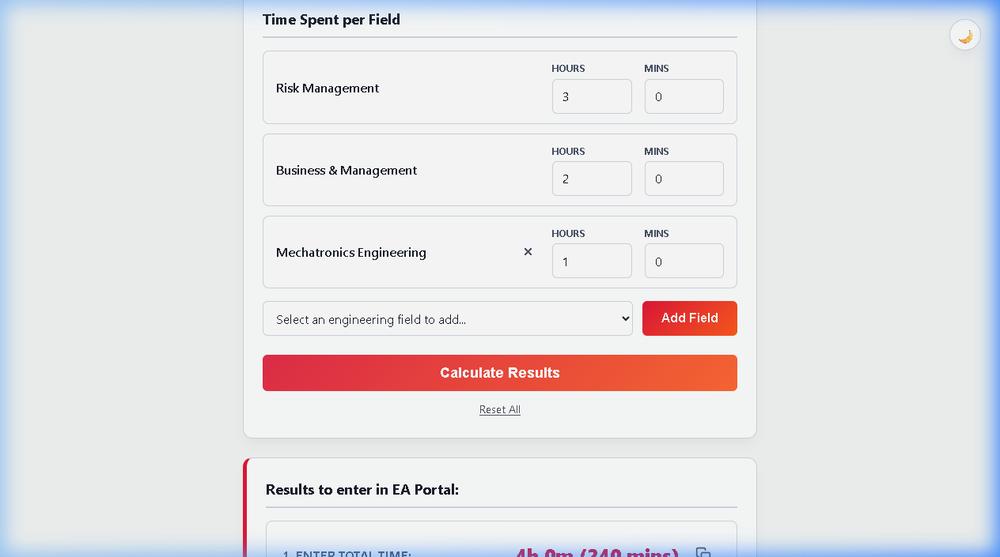
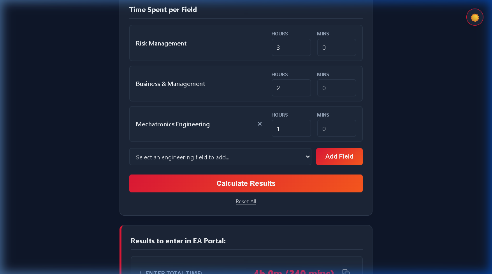
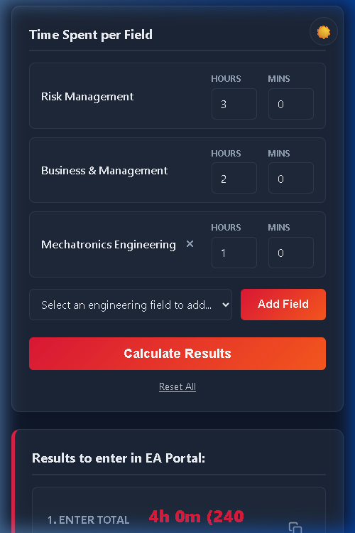
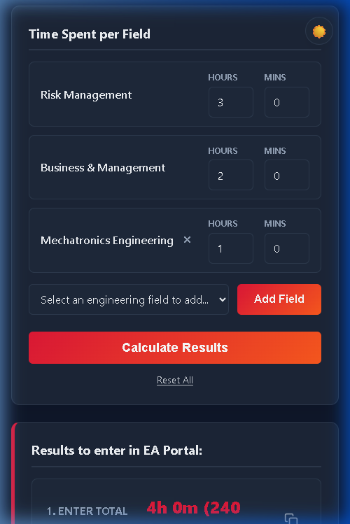

# EA CPD Ratio Calculator

**Free, open-source tool for Engineers Australia CPD reporting.**  
Skip the guesswork — enter your actual time spent and instantly get the correct ratio options to enter in the EA Portal.

---

## 🚀 Try It Now

**[➡ Open the EA CPD Ratio Calculator](https://aaron-fredrick.github.io/EA-CPD-Ratio-Calculator/)**

No login. No install. Works on any device.

---

## 📸 Screenshots

### Desktop — Light Mode

### Desktop — Dark Mode

### Mobile — Light Mode

### Mobile — Dark Mode

---

## 🎥 Demo

---

## ❓ How It Works

Engineers Australia's CPD portal only accepts fixed ratio options: **N/A (0%)**, **Some (25%)**, **Half (50%)**, **Most (75%)**, or **All (100%)** — for each engineering field. These ratios are applied to a rounded total time, making it non-trivial to match what you actually spent.

This tool:

1. Takes the **actual hours and minutes** you spent in each field.
2. Runs a **brute-force search** over all valid total-time values (in 15-minute increments) to find which combination minimises the error between what EA would calculate and your actual time.
3. Outputs the **exact total time to enter** in the portal, plus the **ratio option to select** for each field.

The algorithm mirrors EA's internal rounding logic:
> `EA_Mins = round(floor(Total × ratio%) / 15) × 15`

---

## ✨ Features

| Feature | Details |
|---|---|
| 🧮 Smart Calculator | Brute-force optimal total time to minimise rounding error |
| 🌙 Dark / Light Mode | Persisted across sessions via `localStorage` |
| 📋 Copy to Clipboard | One-tap copy of the total time value |
| 🔗 Share Results | Generates a shareable URL with your inputs encoded |
| 💾 Auto-Save | Field values persist across page reloads |
| ♿ Accessible | WCAG AA contrast, ARIA labels, keyboard navigable |
| 📱 Mobile-Friendly | Responsive layout, 44px touch targets, no iOS zoom |

---

## 🛠 Tech Stack

- **Pure HTML / CSS / JavaScript** — zero dependencies, zero build step
- **Google Analytics 4** — anonymised usage insights
- **Microsoft Clarity** — heatmaps and scroll depth for UX improvement
- **GitHub Pages** — free, zero-config hosting

---

## 📋 Engineering Fields Supported

Risk Management · Business & Management · Biomedical · Chemical · Civil · Construction · Electrical · Environmental · Information & Telecommunications · Leadership & Management · Mechanical · Structural · Aerospace · Building Services · Naval Architecture · Pressure Equipment · Fire Safety · Amusement Rides · Geotechnical · Systems · Oil & Gas Pipeline · Heritage & Conservation · Petroleum · Cost · Risk · Asset Management · Project Management · Subsea · Mechatronics · Cyber Engineering

---

## 🐛 Reporting Issues

Found a bug or have a suggestion?  
[**Open an issue on GitHub →**](https://github.com/aaron-fredrick/EA-CPD-Ratio-Calculator/issues/new)

---

## ⚖️ Disclaimer

This tool is **not affiliated with Engineers Australia (EA)**.  
All calculations are based on observed portal behaviour and may not match EA's official algorithm exactly. Always verify your final entry in the [official EA portal](https://portal.engineersaustralia.org.au/).

---

## 📄 License

[MIT](LICENSE) © [Aaron Fredrick](https://github.com/aaron-fredrick)
